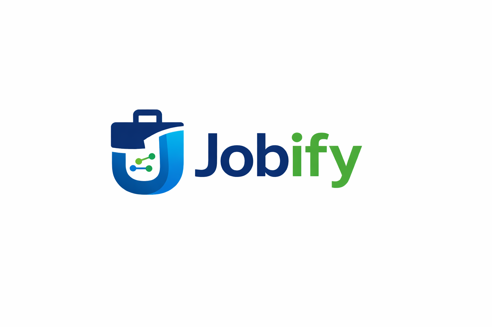
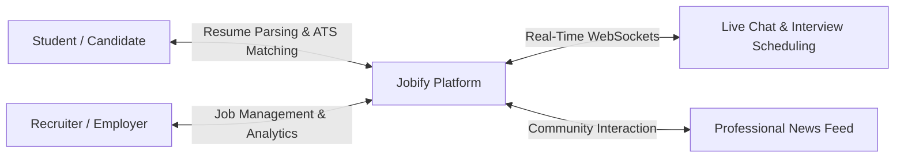

<div align="center">

  

  # Jobify 🚀

  **Next-Generation AI-Ready Recruitment & Career Acceleration Platform**

  *Connecting ambitious students and modern recruiters through intelligent resume parsing, automated ATS scoring, real-time messaging, and actionable talent analytics.*

  <br />

  [](https://jobify-nu-flame.vercel.app/)
  [](https://react.dev/)
  [](https://nodejs.org/)
  [](https://expressjs.com/)
  [](https://www.mongodb.com/)
  [](https://socket.io/)
  [](https://tailwindcss.com/)
  [](LICENSE)

  <br />

  [🌐 Live Application](https://jobify-nu-flame.vercel.app/) •
  [✨ Key Features](#-key-features) •
  [🛠️ Tech Stack](#️-tech-stack) •
  [⚡ Quick Start](#-quick-start) •
  [🔑 Demo Accounts](#-demo-accounts) •
  [📡 API Reference](#-api-reference) •
  [🚀 Deployment](#-deployment-guide)

</div>

---

## 📌 Overview

**Jobify** is a unified full-stack hiring and career platform engineered to streamline the end-to-end recruitment lifecycle. By eliminating fragmented tooling, Jobify equips candidates with resume intelligence and automated application capabilities, while providing recruiters with an Applicant Tracking System (ATS), interactive candidate evaluation tools, integrated real-time chat with interview scheduling, and deep pipeline analytics.



---

## ✨ Key Features

### 🎓 Candidate & Student Experience
- **Smart Resume Center**:
  - Upload PDF resumes with automated skill extraction powered by `pdf-parse` & `textract`.
  - Built-in interactive **Resume Builder** for crafting ATS-optimized profiles.
  - **Resume Version History**: Track revisions and compare skill coverage across versions.
  - **ATS Score Preview**: Real-time compatibility score matching candidate skills against active job descriptions.
  - Automated skill and improvement suggestions to boost application success.
- **Job Discovery & Matching**:
  - Filter jobs by role, domain, location, and required tech stack.
  - **Recommended Jobs**: Tailored job matches computed from skill overlap percentages.
  - **1-Click Apply & Auto-Apply**: Set a custom ATS threshold (e.g., $\ge 80\%$) to automatically apply to matching openings.
- **Application Tracking Pipeline**:
  - Live status tracking across each phase: `Pending` ➔ `Reviewing` ➔ `Shortlisted` ➔ `Interview Scheduled` ➔ `Accepted` / `Rejected`.
- **Integrated Real-Time Chat**:
  - Direct communication with hiring managers.
  - Receive, review, and accept interview invitations inside the conversation.
  - Share portfolios, documents, and attachments directly.

---

### 💼 Recruiter & Hiring Experience
- **Job & Requisition Management**:
  - Create, edit, archive, reactivate, and delete job postings.
  - Define required skills, experience levels, salary brackets, and work arrangements (Remote / Hybrid / Onsite).
  - Multi-recruiter team collaboration: Assign co-recruiters to managed openings.
- **Candidate Evaluation & ATS Pipeline**:
  - Review candidate applications sorted and filtered by match score and status.
  - Examine parsed resumes, portfolio links, and extracted competencies.
  - Update candidate stage and attach internal evaluation notes.
- **In-Chat Interview Scheduling**:
  - Schedule interviews directly from the candidate conversation thread.
  - Specify interview date, time, format (Video / Phone / In-person), and meeting links.
  - Track interview status lifecycle (`Scheduled`, `Completed`, `Cancelled`).
- **Talent Analytics Dashboard**:
  - **Recruitment Funnel**: Visual progression from application to offer.
  - **Application Trends**: Time-series volume analysis via interactive Recharts.
  - **Response Times & Bottlenecks**: Gauge hiring velocity and communication SLAs.
  - **Skill Gap Analysis**: Radar and bar charts comparing job requirements against applicant pools.

---

### 🌐 Platform & Social Features
- **Professional News Feed**:
  - Community feed for job market discussions, career milestones, and industry news.
  - Rich post authoring with image uploads (Cloudinary / local storage).
  - Interactive social engagement: likes, comments, and reposts.
- **Enterprise-Grade Security**:
  - Role-Based Access Control (RBAC) protecting endpoints and frontend routes.
  - Secure JWT authentication with **token version invalidation** (instant token revocation upon logout or password changes).
  - Session history and active login tracking.
  - Secure password changes, email update verification flows, and full account deletion.

---

## 🛠️ Tech Stack

| Domain | Technology | Description |
| :--- | :--- | :--- |
| **Frontend Framework** | [React 19](https://react.dev/) + [Vite 7](https://vitejs.dev/) | High-performance SPA with fast HMR |
| **Styling & UI** | [Tailwind CSS 3.4](https://tailwindcss.com/) | Utility-first, responsive design system |
| **Icons & Motion** | [Lucide React](https://lucide.dev/) & [React Spring](https://www.react-spring.dev/) | Modern icon suite & physics-based animations |
| **Data Visualization**| [Recharts 3.7](https://recharts.org/) | Responsive SVG charts for recruiter analytics |
| **Backend Runtime** | [Node.js 18+](https://nodejs.org/) & [Express 5](https://expressjs.com/) | RESTful API server & middleware engine |
| **Database & ODM** | [MongoDB](https://www.mongodb.com/) & [Mongoose 9](https://mongoosejs.com/) | Document database with schematized data models |
| **Real-Time Engine** | [Socket.io 4.8](https://socket.io/) | Bi-directional WebSocket communication for chat |
| **Authentication** | [JSON Web Tokens (JWT)](https://jwt.io/) & [bcryptjs](https://github.com/dcodeIO/bcrypt.js) | Stateless auth with salted password hashing |
| **File Processing** | [Multer](https://github.com/expressjs/multer), [pdf-parse](https://www.npmjs.com/package/pdf-parse), [textract](https://www.npmjs.com/package/textract) | Multipart handling & PDF text/skill extraction |
| **Cloud Storage** | [Cloudinary](https://cloudinary.com/) | Cloud hosting for avatars, attachments & media |
| **Deployment** | [Vercel](https://vercel.com/) & [Render](https://render.com/) | Frontend CDN & Backend managed cloud service |

---

## 🏗️ Architecture & Directory Layout

```text
jobify/
├── client/                     # Frontend Application (React + Vite)
│   ├── public/                 # Static branding and assets
│   ├── src/
│   │   ├── api/                # Axios API instance and endpoints
│   │   ├── assets/             # Illustrations, logos, and graphics
│   │   ├── components/         # Shared UI elements & layouts
│   │   │   ├── feed/           # News feed posts, navbar & cards
│   │   │   ├── CornerLogo.jsx  # Persistent corner branding
│   │   │   ├── ProtectedRoute.jsx # RBAC route guard
│   │   │   ├── RecruiterLayout.jsx
│   │   │   └── StudentLayout.jsx
│   │   ├── pages/              # Application views & dashboards
│   │   │   ├── LandingPage.jsx         # Public landing page
│   │   │   ├── NewsFeed.jsx            # Social feed & updates
│   │   │   ├── StudentDashboard.jsx    # Candidate job board
│   │   │   ├── StudentResumeCenter.jsx # Resume builder & ATS tools
│   │   │   ├── StudentApplications.jsx # Status tracking
│   │   │   ├── RecruiterDashboard.jsx  # Candidate pipeline management
│   │   │   ├── RecruiterAnalytics.jsx  # Recharts analytics suite
│   │   │   ├── Messages.jsx            # Live chat & interview scheduler
│   │   │   └── AccountSettings.jsx     # Security & session controls
│   │   ├── App.jsx             # Route definitions & transitions
│   │   └── main.jsx            # React root mount
│   ├── tailwind.config.js      # Tailwind theme configuration
│   └── vite.config.js          # Vite configuration
│
├── server/                     # Backend Application (Express + Node.js)
│   ├── config/
│   │   ├── db.js               # MongoDB connection handler
│   │   └── socket.js           # Socket.io setup & user socket mapping
│   ├── controllers/            # Business logic controllers
│   ├── middleware/             # Auth, error handling & upload filters
│   ├── models/                 # Mongoose schemas (User, Job, Application, etc.)
│   ├── routes/                 # Express API routes
│   ├── scripts/
│   │   ├── seedDemoData.js     # Rich database seeder script
│   │   └── generateMockDataPdf.js # Test document generator
│   ├── uploads/                # Local file storage fallback
│   ├── server.js               # Express & HTTP server entrypoint
│   └── package.json            # Backend dependencies & scripts
│
├── LICENSE                     # MIT License
└── README.md                   # Project documentation
```

---

## ⚡ Quick Start

### Prerequisites
- **Node.js**: v18.0.0 or higher
- **npm**: v9.0.0 or higher
- **MongoDB**: Local instance running or a free [MongoDB Atlas](https://www.mongodb.com/atlas) cluster URI

---

### 1. Clone the Repository

```bash
git clone https://github.com/rutvikmanmode/Jobify.git
cd Jobify
```

---

### 2. Configure Environment Variables

#### Backend (`server/.env`)
Create a file at `server/.env` (or duplicate `server/.env.example`):

```env
# Server Configuration
PORT=5000
NODE_ENV=development
CLIENT_URL=http://localhost:5173

# Database & Security
MONGO_URI=mongodb+srv://<username>:<password>@cluster.mongodb.net/jobify?retryWrites=true&w=majority
JWT_SECRET=your_super_secret_jwt_key_here

# Optional: Cloudinary Storage (falls back to local disk if unconfigured)
CLOUDINARY_CLOUD_NAME=your_cloud_name
CLOUDINARY_API_KEY=your_api_key
CLOUDINARY_API_SECRET=your_api_secret
```

#### Frontend (`client/.env`)
Create a file at `client/.env` (or duplicate `client/.env.example`):

```env
VITE_API_BASE_URL=http://localhost:5000/api
```

---

### 3. Install Dependencies

In your terminal, install dependencies for both services:

```bash
# Install backend dependencies
cd server
npm install

# Install frontend dependencies
cd ../client
npm install
```

---

### 4. Seed Demo Data *(Recommended)*

Populate your database with realistic recruiters, verified companies, candidates, active job postings, application histories, and feed posts:

```bash
cd server
npm run seed:demo
```

> [!TIP]
> To wipe existing demo records and reseed from a clean state, run:
> ```bash
> npm run seed:demo:reset
> ```

---

### 5. Run the Application

Run the backend and frontend in two separate terminals:

#### Terminal 1 — Backend:
```bash
cd server
npm run dev
```
> Server runs at `http://localhost:5000`

#### Terminal 2 — Frontend:
```bash
cd client
npm run dev
```
> Client runs at `http://localhost:5173`

---

## 🔑 Demo Accounts

Use any of these pre-seeded demo accounts to explore the platform. 

> **Default password for all seeded accounts:** `Password@123`

| Role | Name | Email | Details |
| :--- | :--- | :--- | :--- |
| **Recruiter** | Aisha Verma | `aisha.verma@neurostack.ai` | Senior Recruiter @ NeuroStack AI |
| **Recruiter** | Rohan Kapoor | `rohan.kapoor@neurostack.ai` | Talent Acquisition @ NeuroStack AI |
| **Recruiter** | Meera Nair | `meera.nair@finbyte.com` | Technical Recruiter @ FinByte Labs |
| **Student** | Arjun Menon | `arjun.menon@studentmail.com` | Final Year CSE — Backend & Cloud |
| **Student** | Priya Shah | `priya.shah@studentmail.com` | Frontend Engineer — React & TypeScript |
| **Student** | Dev Patel | `dev.patel@studentmail.com` | Full Stack Developer |

---

## 📡 API Reference

All REST endpoints are prefixed with `/api`. Authenticated routes require an `Authorization: Bearer <token>` header.

### 🔐 Authentication & Account (`/api/auth`)
| Method | Endpoint | Access | Description |
| :--- | :--- | :--- | :--- |
| `POST` | `/api/auth/register` | Public | Register new student or recruiter |
| `POST` | `/api/auth/login` | Public | Authenticate user & receive JWT token |
| `GET` | `/api/auth/account/settings` | Private | Retrieve user account preferences |
| `POST` | `/api/auth/account/change-password` | Private | Update account password |
| `POST` | `/api/auth/account/request-email-update` | Private | Initiate email verification flow |
| `POST` | `/api/auth/account/verify-email-update` | Private | Confirm email verification token |
| `GET` | `/api/auth/account/login-activity` | Private | View active sessions & sign-in logs |
| `POST` | `/api/auth/account/logout-all-devices` | Private | Revoke all active tokens via version increment |
| `DELETE`| `/api/auth/account/delete` | Private | Permanently delete account |

### 📄 Profile & Resumes (`/api/profile` & `/api/resume`)
| Method | Endpoint | Access | Description |
| :--- | :--- | :--- | :--- |
| `GET` | `/api/profile/me` | Private | Fetch logged-in user profile |
| `PUT` | `/api/profile/me` | Private | Update profile bio, skills, education |
| `POST` | `/api/profile/photo` | Private | Upload profile picture |
| `GET` | `/api/profile/recruiter/:id`| Private | View public recruiter & company info |
| `POST` | `/api/resume/upload` | Student | Upload resume PDF & auto-extract skills |
| `GET` | `/api/resume/history` | Student | Retrieve uploaded resume versions |
| `GET` | `/api/resume/builder` | Student | Fetch structured resume builder data |
| `POST` | `/api/resume/builder` | Student | Save structured resume builder data |
| `GET` | `/api/resume/score-preview/:jobId` | Student | Calculate ATS match score against a job |
| `GET` | `/api/resume/skill-suggestions` | Student | Get recommended skills to add |
| `GET` | `/api/resume/improvement-suggestions` | Student | Get resume quality tips |

### 💼 Jobs & Recommendations (`/api/jobs`)
| Method | Endpoint | Access | Description |
| :--- | :--- | :--- | :--- |
| `GET` | `/api/jobs` | Private | List all open job opportunities |
| `POST` | `/api/jobs` | Recruiter | Create a new job requisition |
| `PUT` | `/api/jobs/:jobId` | Recruiter | Update job details |
| `DELETE`| `/api/jobs/:jobId` | Recruiter | Delete a job posting |
| `PATCH`| `/api/jobs/:jobId/status` | Recruiter | Archive or activate job posting |
| `POST` | `/api/jobs/:jobId/recruiters` | Recruiter | Assign co-recruiter to job |
| `GET` | `/api/jobs/recommended` | Student | Fetch jobs scored by skill relevance |
| `GET` | `/api/jobs/company/:companyName` | Private | Retrieve company overview & active jobs |

### 📬 Applications (`/api/applications`)
| Method | Endpoint | Access | Description |
| :--- | :--- | :--- | :--- |
| `POST` | `/api/applications/:jobId` | Student | Apply to a job |
| `DELETE`| `/api/applications/:jobId` | Student | Withdraw application |
| `GET` | `/api/applications/my` | Student | List student's submitted applications |
| `POST` | `/api/applications/auto-apply` | Student | Auto-apply to jobs matching score threshold |
| `GET` | `/api/applications/job/:jobId` | Recruiter | View all applicants for a specific job |
| `PATCH`| `/api/applications/:applicationId/status` | Recruiter | Update stage (`Reviewing`, `Accepted`, etc.) |
| `PATCH`| `/api/applications/:applicationId/review` | Recruiter | Save internal candidate review notes |

### 💬 Messaging & Interviews (`/api/messages`)
| Method | Endpoint | Access | Description |
| :--- | :--- | :--- | :--- |
| `GET` | `/api/messages/contacts` | Private | Search user directory for messaging |
| `GET` | `/api/messages/conversations` | Private | List all active direct conversations |
| `POST` | `/api/messages/conversations` | Private | Create or fetch conversation thread |
| `GET` | `/api/messages/conversations/:id/messages` | Private | Get messages for a thread |
| `POST` | `/api/messages/conversations/:id/messages` | Private | Send a new message |
| `POST` | `/api/messages/conversations/:id/interviews` | Recruiter | Schedule an interview inside chat |
| `PATCH`| `/api/messages/interviews/:messageId/status` | Private | Update interview status (`Accepted`, etc.) |
| `POST` | `/api/messages/upload` | Private | Upload chat attachment file |

### 📊 Recruiter Analytics (`/api/analytics`)
| Method | Endpoint | Access | Description |
| :--- | :--- | :--- | :--- |
| `GET` | `/api/analytics/overview` | Recruiter | Fetch funnel metrics, volume trends & skill gaps |

### 📰 News Feed (`/api/posts`)
| Method | Endpoint | Access | Description |
| :--- | :--- | :--- | :--- |
| `GET` | `/api/posts` | Private | Retrieve feed posts (newest first) |
| `POST` | `/api/posts` | Private | Create new feed post with optional image |
| `PUT` | `/api/posts/:id/like` | Private | Toggle like on a post |
| `POST` | `/api/posts/:id/comments` | Private | Add comment to post |
| `POST` | `/api/posts/:id/repost` | Private | Repost an existing post with thoughts |
| `DELETE`| `/api/posts/:id` | Private | Delete own post |

---

## 🔌 Real-Time WebSocket Events

The application initializes Socket.io on top of the Express HTTP server:

| Event Name | Direction | Payload | Description |
| :--- | :--- | :--- | :--- |
| `register` | Client ➔ Server | `userId: string` | Associates the socket connection with the authenticated user ID |
| `disconnect` | Client ➔ Server | — | Removes socket from active connection pool |
| `new_message` | Server ➔ Client | `MessageObject` | Emitted when a recipient receives a new chat message |
| `interview_invite` | Server ➔ Client | `InterviewObject` | Emitted when an interview is scheduled within a conversation |

---

## 🚀 Deployment Guide

### Deploy Backend to Render

1. Create a new **Web Service** on [Render](https://render.com/) and connect your GitHub repository.
2. Configure settings:
   - **Root Directory**: `server`
   - **Build Command**: `npm install`
   - **Start Command**: `npm start`
3. Add Environment Variables:
   - `NODE_ENV`: `production`
   - `PORT`: `5000`
   - `MONGO_URI`: *Your MongoDB connection string*
   - `JWT_SECRET`: *A secure random secret*
   - `CLIENT_URL`: `https://your-app.vercel.app` *(or `https://*.vercel.app` for preview links)*
   - `CLOUDINARY_CLOUD_NAME`, `CLOUDINARY_API_KEY`, `CLOUDINARY_API_SECRET` *(optional)*

---

### Deploy Frontend to Vercel

1. Import the repository into [Vercel](https://vercel.com/).
2. Configure settings:
   - **Root Directory**: `client`
   - **Framework Preset**: `Vite`
   - **Build Command**: `npm run build`
   - **Output Directory**: `dist`
3. Add Environment Variable:
   - `VITE_API_BASE_URL`: `https://your-render-backend.onrender.com/api`
4. Deploy!

---

## 🤝 Contributing

Contributions are what make the open-source community an amazing place to learn, inspire, and create. Any contributions you make are **greatly appreciated**.

1. Fork the Project
2. Create your Feature Branch (`git checkout -b feature/AmazingFeature`)
3. Commit your Changes (`git commit -m 'Add some AmazingFeature'`)
4. Push to the Branch (`git push origin feature/AmazingFeature`)
5. Open a Pull Request

---

## 📄 License

Distributed under the **MIT License**. See [`LICENSE`](LICENSE) for more details.

---

<div align="center">
  Crafted with ❤️ by <a href="https://github.com/rutvikmanmode">Rutvik Manmode</a>
</div>
